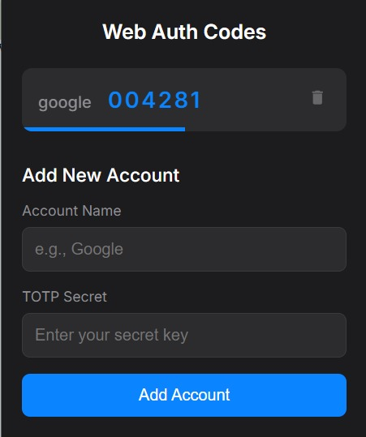

# ✨ TOTP Vault ✨

A secure and simple Chrome Extension for managing your Time-based One-Time Passwords (TOTP) for 2-Factor Authentication (2FA). Never reach for your phone again!

---

## 🚀 Key Features

-   🔐 **Secure Storage:** Your TOTP secrets are fully encrypted using the powerful Web Crypto API and stored securely in Chrome's local storage.
-   📋 **One-Click Copy:** Simply click on an account to instantly copy the current 2FA code to your clipboard.
-   ➕ **Easy Setup:** A straightforward form allows you to add new accounts in seconds.
-   🗑️ **Simple Deletion:** Easily remove accounts you no longer need with a confirmation step to prevent accidents.
-   👀 **Visual Timer:** A sleek progress bar shows the time remaining before your codes refresh.
-   🌑 **Dark Mode:** A beautiful dark theme that's easy on the eyes.

---

## 📸 Screenshot

*(Here's where a beautiful screenshot of the extension in action would go!)*

---

## 🛠️ Installation

Since this is a custom-built extension, you'll need to load it into Chrome manually. It's easy!

1.  **Download the Code:** First, make sure you have the `auth-ext` folder on your computer.
2.  **Open Chrome Extensions:** Open your Google Chrome browser and navigate to `chrome://extensions`.
3.  **Enable Developer Mode:** In the top-right corner of the Extensions page, find the **"Developer mode"** toggle and make sure it is switched **ON**.
4.  **Load the Extension:**
    -   Click the **"Load unpacked"** button that appeared.
    -   A file dialog will open. Navigate to and select the `auth-ext` folder.
5.  **Done!** ✅ The "Web Auth Codes" extension should now appear in your list of extensions and in your Chrome toolbar (you may need to pin it by clicking the puzzle piece icon).

---

## 💡 How to Use

-   **Adding an Account:**
    1.  Open the extension popup.
    2.  Fill in the "Account Name" (e.g., "Google", "GitHub").
    3.  Paste your TOTP secret key into the "TOTP Secret" field.
    4.  Click "Add Account".

-   **Copying a Code:**
    -   Simply click anywhere on the account card (the area with the name and code). The code will be copied to your clipboard, and you'll see a "Copied!" confirmation.

-   **Deleting an Account:**
    -   Click the trash can icon 🗑️ on the right side of the account you wish to remove.
    -   A confirmation dialog will appear. Click "OK" to permanently delete the account.

---

## 💻 Tech Stack

This extension was built using a modern, lightweight tech stack:

-   **HTML5** for the core structure.
-   **CSS3** for all the custom styling and animations.
-   **JavaScript (ES6+)** for all the application logic.
-   **[otplib](https://github.com/yeojz/otplib):** A fantastic library for generating the TOTP codes.
-   **Web Crypto API:** For robust, native browser encryption.
-   **Chrome Storage API:** For securely persisting your encrypted secrets.

---

## 📄 License

This project is open-source and available for everyone to use and modify.

  Made with ❤️ and a lot of coffee.

